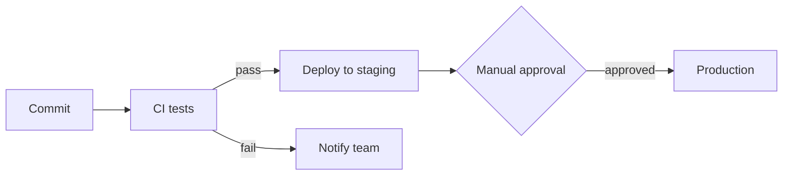

# Rollmark

**Markdown that carries charts — built for reports written by AI.**

## What it is

Rollmark is two things that only work because they were designed together:

1. **A tiny chart language that lives inside Markdown.** When an AI assistant writes a report, it writes ordinary Markdown — and where a chart belongs, it writes a small fenced text block: the chart type, a title, a one-sentence summary, and the data as a pipe-separated table. No JSON nesting, no configuration, no styling. The block is readable on its own, like a labeled table.
2. **A renderer with opinions.** Rollmark parses the document, validates every chart against strict rules, and draws it as clean SVG — consistent typography, spacing, palette, light/dark themes, hover tooltips, accessibility labels. All of it automatic.

The whole loop, concretely. The model writes this:

```chart
line
title: Daily visitors
summary: Daily visitors grew from 1,240 on Monday to a peak of 1,610 on Saturday.

date | Visitors
2026-08-03 | 1240
2026-08-04 | 1380
2026-08-05 | 1350
2026-08-06 | 1470
2026-08-07 | 1510
2026-08-08 | 1610
2026-08-09 | 1540
```

Readers see this:

<picture>
  <source media="(prefers-color-scheme: dark)" srcset="https://raw.githubusercontent.com/stumptowndoug/rollmark/master/docs/images/hero-dark.svg">
  
</picture>

And anywhere Rollmark isn't installed — GitHub, a text editor, an email preview — the same document shows the readable text block above instead. **Nothing ever breaks; it just gets plainer.** (Every chart image on this page is genuine output from Rollmark's renderer.)

## Why we're building it

AI assistants and agents now write the reports: analytics summaries, service health checks, morning briefs. Text alone undersells the data — but every existing way to let a model make charts fails somewhere:

- **Full charting languages** (Vega-Lite, ECharts configs) are verbose and easy for a model to get subtly wrong, and they hand the model control of colors, fonts, and layout — so reliability drops and every report looks different.
- **Model-written HTML/SVG** can't be validated or audited — you can't even check whether the numbers in the picture match the source data — and injecting model markup into your app is a security problem.
- **Generated images** are opaque: not checkable, not editable, not re-themeable, not accessible.

The common root cause is giving the model too much surface. Rollmark goes the other way: make the language so small that models get it right, and let the renderer make it beautiful. That claim is tested, not assumed — this repo ships an eval harness that runs real models (nine families, from 8B-parameter to frontier) through report-writing tasks. Current baseline: **100% of chart blocks parse and validate, 100% of source numbers preserved exactly, and correct chart-type choices at every model size.** Every failure mode the evals have ever caught became a rule in the shipped prompt kit.

## The minimalist approach

One principle carries the whole design:

> **Models state facts. The renderer owns everything visual.**

A chart block can express *what the data is* — type, values, labels, a summary sentence, whether series stack. It cannot express a color, a font, a size, or any styling; those knobs simply don't exist in the language, and unknown properties are ignored. That's why output is reliable (nothing decorative to get wrong), consistent (every chart in your product looks like it belongs), and durable (documents re-render perfectly when themes or renderers improve).

The discipline extends to how Rollmark grows:

- **Few visualizations, on purpose.** Five chart types plus Mermaid diagrams cover the overwhelming majority of what reports need. Nothing joins the vocabulary unless real models — including small, cheap ones — produce it reliably in the eval gate.
- **Conventions instead of configuration.** First table column is the x-axis. Headers are the labels. ISO dates make a time axis automatically. Empty cells are gaps, never zeroes.
- **Failure is local.** An invalid chart becomes a small card showing its own summary sentence and what went wrong; the rest of the document renders normally.
- **Untrusted by default.** Documents are model output: raw HTML is neutralized, diagrams run in Mermaid's strict security mode, and the parser is fuzz-tested to never crash.
- The *application* embedding Rollmark can pick a named palette or supply brand colors, and readers get hover tooltips automatically — consumer options, invisible to the model and the document.

## Every visualization, one by one

The complete vocabulary. Each example below is real: the block on top is what a model writes, the chart below it is what Rollmark renders.

### `bar` — comparing categories

```chart
bar
title: Tickets opened vs. resolved by area
summary: API had the most activity with 45 opened and 31 resolved.

area | Opened | Resolved
Billing | 34 | 29
Onboarding | 21 | 22
API | 45 | 31
```

<picture>
  <source media="(prefers-color-scheme: dark)" srcset="https://raw.githubusercontent.com/stumptowndoug/rollmark/master/docs/images/bar-dark.svg">
  
</picture>

### `bar` + `stack: true` — parts of a whole across categories

```chart
bar
stack: true
title: Quarterly revenue by product line
summary: Every line grew through the year; software closed most of the gap to hardware by Q4.

quarter | Hardware | Software | Services
Q1 | 420 | 310 | 150
Q2 | 390 | 360 | 175
Q3 | 455 | 410 | 190
Q4 | 510 | 465 | 230
```

<picture>
  <source media="(prefers-color-scheme: dark)" srcset="https://raw.githubusercontent.com/stumptowndoug/rollmark/master/docs/images/stacked-dark.svg">
  
</picture>

### `line` — trends over an ordered axis

Shown in the intro above. Dates written as `2026-08-03` become a proper time axis automatically; a missing value renders as a gap in the line, never as zero.

### `area` — magnitude over time

```chart
area
stack: true
title: Overnight requests by service (thousands)
summary: The API carried most overnight traffic; jobs spiked during the 04:00 batch window.

hour | API | Auth | Jobs
00:00 | 91 | 22 | 8
02:00 | 84 | 19 | 9
04:00 | 78 | 17 | 21
06:00 | 95 | 24 | 10
```

<picture>
  <source media="(prefers-color-scheme: dark)" srcset="https://raw.githubusercontent.com/stumptowndoug/rollmark/master/docs/images/area-dark.svg">
  
</picture>

### `scatter` — the relationship between two measures

```chart
scatter
title: Price vs. rating
summary: Higher-priced products loosely track higher ratings.

price | Rating
9.99 | 3.8
14.5 | 4.1
19.99 | 4.0
24.5 | 4.4
34.0 | 4.6
49.99 | 4.5
```

<picture>
  <source media="(prefers-color-scheme: dark)" srcset="https://raw.githubusercontent.com/stumptowndoug/rollmark/master/docs/images/scatter-dark.svg">
  
</picture>

### `pie` — shares of a whole

Rendered as a donut with an annotated legend; at most 8 slices, with any long tail bucketed into "Other" — the renderer's opinions at work.

```chart
pie
title: Subscribers by plan
summary: Free accounts make up about three quarters of subscribers.

plan | Subscribers
Free | 9120
Pro | 2480
Team | 640
```

<picture>
  <source media="(prefers-color-scheme: dark)" srcset="https://raw.githubusercontent.com/stumptowndoug/rollmark/master/docs/images/donut-dark.svg">
  
</picture>

### `mermaid` — relationships and structure

For workflows, dependencies, sequences, and schedules, documents use standard [Mermaid](https://mermaid.js.org/) blocks (rendered with strict security settings). GitHub renders these natively — the diagram below is your browser rendering the same source a model would write:



**And deliberately nothing else.** No gauges, no 3D, no dual axes, no word clouds. A model is also prompted *not* to chart at all when the data is one or two values — a report with no chart beats a report with a pointless one.

One more rule ties the vocabulary together: every chart carries a `summary:` sentence. It's the text that appears in email and plain-text exports, the description screen readers announce, the fallback if a chart can't render — and an LLM judge in the eval suite checks it tells the truth about the data.

## How it works

1. **A model writes the report** — ordinary Markdown with chart blocks where charts belong, guided by the shipped prompt snippet (`promptKit.format`).
2. **Rollmark parses and validates** — every block is checked against the format's rules; invalid ones degrade to graceful fallback cards.
3. **Rollmark renders** — its own SVG renderer draws every chart in one editorial style, themed light or dark. The same renderer runs in the browser and on a server, so PDF and email exports are the identical output.

## For developers

```ts
import mermaid from "mermaid"; // optional, for diagram blocks
import { mountRollmarkDocument, promptKit } from "rollmark";

// 1. Tell your model the format (host-owned document instructions + the contract):
const system = `${yourOutputInstructions}\n\n${promptKit.format}`;

// 2. Render what it writes:
await mountRollmarkDocument(container, markdownFromYourModel, {
  theme: "auto",              // follows the user's light/dark preference
  palette: "okabe-ito",       // optional: default | okabe-ito | muted | monochrome
  colors: { series: [...] },  // optional: brand colors win over any palette
  mermaid,                    // initialized with securityLevel: "strict" for you
});
// Hover tooltips are on automatically (tooltips: false to opt out).
```

Server-side, `renderRollmark()` and `renderChartSVG()` return HTML and SVG strings with no DOM. Install from a release tarball until the npm publish:

```json
"rollmark": "https://github.com/stumptowndoug/rollmark/releases/download/v0.1.2/rollmark-0.1.2.tgz"
```

| To go deeper | |
|---|---|
| Write chart blocks (or prompt a model to) | [`docs/chart-dsl.md`](./docs/chart-dsl.md) |
| The prompt kit (importable sections + few-shot examples) | [`prompt-kit/`](./prompt-kit/) |
| The formal format specification | [`SPEC.md`](./SPEC.md) |
| Example reports | [`examples/`](./examples/) |
| Eval results and lessons | [`evals/FINDINGS.md`](./evals/FINDINGS.md) |
| Live editor + eval browser | `npm run playground` / `npm run viewer` |
| Design history | [`docs/design/`](./docs/design/) |

Development: `npm install && npm test` (107 tests incl. SVG snapshots and parser fuzzing) · `npm run build` · `npm run build:images` regenerates every chart on this page from source.

## Status

**v0.1.x, incubating.** The format grows slowly by design: nothing is added unless real models produce it reliably (the eval gate), and presentation options are never added at all. Reserved for later: more block types (`metrics`, `timeline`, `status`), a Vega-Lite escape hatch for power users, streaming-aware rendering.

MIT licensed.
