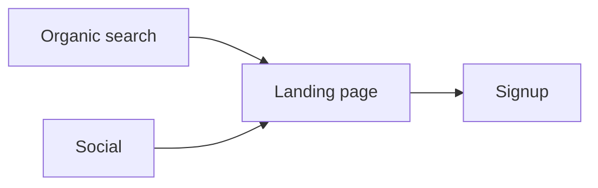

# Rollmark Specification

**Version 1 — draft, August 2026**

Rollmark is a Markdown-based document format for AI-generated visual reports. A Rollmark document is ordinary Markdown in which a small number of specially labeled fenced code blocks carry semantic meaning: a Rollmark renderer upgrades them into visual components, while any other Markdown viewer displays them as plain code blocks.

Springroll is the first intended consumer, but nothing in this specification is Springroll-specific.

## Design goals

1. **Every Rollmark document is a valid Markdown document.** No new grammar, no preprocessing. A Rollmark document opened in GitHub, a text editor, or any CommonMark viewer remains readable; visual blocks degrade to their source.
2. **Models set data, chart type, labels, and intent. The renderer sets everything visual** — colors, typography, axes, spacing, animation, theme, and accessibility defaults. This is a spec principle, not an implementation preference: it is the criterion for rejecting schema additions.
3. **The persisted format is independent of any rendering library.** A `chart` block describes a visualization semantically; which engine draws it is a renderer implementation detail.
4. **Failure is graceful and local.** A malformed block degrades to readable fallback content. It never breaks the surrounding document.
5. **The format is designed to be generated.** The chart language is deliberately small, Markdown-native, and accompanied by a prompt kit; the equivalent JSON shape is published as JSON Schema for structured-output pipelines. Reliability of model generation is measured, not assumed.

## Conformance language

The key words MUST, MUST NOT, SHOULD, SHOULD NOT, and MAY are to be interpreted as described in RFC 2119.

Two conformance roles exist:

- A **producer** is anything that emits Rollmark documents (typically a model, possibly via a serializer).
- A **renderer** is anything that displays Rollmark documents.

---

## 1. Document format

### 1.1 Base Markdown

A Rollmark document is a [CommonMark](https://commonmark.org/) document. Renderers MUST support CommonMark and SHOULD support the following GFM extensions:

- Tables
- Strikethrough
- Task lists
- Autolinks

### 1.2 Raw HTML

Rollmark documents are typically model-generated and MUST be treated as untrusted input. Renderers MUST NOT execute or render raw HTML from the document by default; raw HTML blocks and inline HTML SHOULD be rendered as escaped text. A renderer MAY offer an opt-in trusted mode with sanitization, but that mode is outside this specification.

### 1.3 Visual blocks

A **visual block** is a fenced code block whose info string's first word is a registered block name. Version 1 registers two block names:

| Block name | Payload | Purpose |
|---|---|---|
| `chart` | Chart DSL or JSON (§2) | Quantitative visualization |
| `mermaid` | Mermaid source (§3) | Diagrams, relationships, flows, schedules |

Rules:

- The block name is the first whitespace-delimited word of the fence info string, compared case-sensitively. Only lowercase names are registered.
- Any additional content in the info string (e.g. ` ```chart foo=bar `) is reserved for future versions. Renderers MUST ignore unrecognized info-string content and treat the block by its name alone.
- A fenced block whose info string names an unregistered block (` ```python `, ` ```metricz `) is an ordinary code block. Renderers MUST render it as code. This is the forward-compatibility mechanism: documents using future block names remain displayable by older renderers.

The following block names are **reserved** for future versions and MUST NOT be given other meanings by extensions: `metrics`, `status`, `timeline`, `progress`, `vega-lite`.

---

## 2. The `chart` block

### 2.1 Canonical payload: the chart DSL

The canonical payload is a small text DSL: the chart type on the first line, optional `key: value` meta lines, then a pipe-separated data table.

````markdown
```chart
line
title: Daily visitors
summary: Daily visitors grew steadily from 1,240 to 1,510 over three days.

date | Visitors
2026-08-01 | 1240
2026-08-02 | 1380
2026-08-03 | 1510
```
````

Grammar:

- **Type line.** The first bare word line is the chart type: `line`, `bar`, `area`, `scatter`, or `pie`. `type: <name>` is accepted as an alternate.
- **Meta lines** are `key: value`. Defined keys: `title` (max 200 chars), `summary` (max 500 chars, see §2.5), `stack` (`true`/`false`), `x-type` (`temporal`/`category`, overriding inference), `x-label`. Unknown keys MUST be ignored (the unknown-property rule).
- **The data table** is pipe-separated: a header row, then 1–1,000 data rows. The first column is the x-axis; each additional column is one series (1–8 total). Column headers are the field names and default labels. GFM-style outer pipes and `|---|` separator rows MUST be tolerated.
- **Cells.** An empty cell (or the literal `null`) is a gap. An unquoted cell that is numeric — including valid thousands groupings such as `12,480` — is a number. A double-quoted cell is always a string and may contain pipes (`"a|b"`, `"007"`). Anything else is a string.
- **Temporal inference.** When `x-type` is not declared and every x value is an ISO 8601 date or date-time string, the axis is temporal. Declared types are never overridden.
- **Orientation.** Each data row is one x-axis entry — one date or one category. Categories go down the first column, never across the header. (Producers MUST be prompted with this rule; transposition is the empirically dominant failure mode of row-oriented syntaxes.)

### 2.2 Alternate payload: JSON

A payload whose first non-whitespace character is `{` is parsed as a JSON object with this shape (the DSL desugars to exactly this):

| Field | Type | Required | Description |
|---|---|---|---|
| `version` | integer | yes | Schema version. MUST be `1`. |
| `type` | string | yes | `"line"`, `"bar"`, `"area"`, `"scatter"`, or `"pie"`. |
| `title` | string | no | Chart title. Max 200 characters. |
| `summary` | string | no (strongly encouraged) | See §2.5. Max 500 characters. |
| `stack` | boolean | no | Stack series; `bar` and `area` only. |
| `x` | object | yes | `{ field, label?, type? }`; `type` is `"category"` or `"temporal"`, inferred from ISO dates when omitted. |
| `series` | array | yes | 1–8 `{ field, label? }` entries; fields MUST be unique. |
| `data` | array of objects | yes | 1–1,000 flat rows keyed by `x.field` and the series fields. |

Values referenced by `x.field` MUST be strings or numbers. Values referenced by `series[].field` MUST be numbers or `null` (`null` renders as a gap, not zero). Rows MAY contain additional fields; renderers ignore them.

The DSL is the canonical, documented, model-facing syntax; JSON acceptance exists for machine producers (serializers, structured-output pipelines). Renderers MUST accept both. Producers SHOULD emit the DSL.

### 2.3 Chart types and validation

Type semantics:

- `line` — trends over an ordered axis.
- `bar` — category comparisons; grouped by default, stacked with `stack: true`.
- `area` — magnitude over an ordered axis; stacked with `stack: true`.
- `scatter` — relationship between two measures. X values MUST be numbers, or ISO 8601 dates (temporal).
- `pie` — shares of a whole. Exactly one series; values MUST be non-negative numbers. Renderers MAY cap slices and bucket the tail into "Other".

A renderer MUST validate the payload before rendering. A payload is invalid if any of the following hold:

1. The payload does not parse (malformed DSL or JSON), or is not a single chart.
2. A required field is missing or has the wrong type.
3. `version` is not a version the renderer supports (DSL payloads are implicitly version 1).
4. `type` is not a type the renderer supports.
5. `series` is empty or has more than 8 entries, or contains duplicate fields.
6. `data` is empty or has more than 1,000 rows.
7. The x field or any series field is absent from **every** row of `data`.
8. The x axis is temporal (declared or inferred) and any x value is not a parseable ISO 8601 string.
9. `stack` is true on a type other than `bar` or `area`.
10. A type-specific rule in the list above is violated (pie shape, scatter x values).

An invalid payload MUST trigger the fallback behavior in §4; it MUST NOT be partially rendered.

**Unknown properties** anywhere in the payload are NOT a validation error. Renderers MUST ignore them; validators SHOULD surface them as warnings (this matters for evals and repair loops, where a model that invents properties should be measurable without hard failure).

**Missing values in individual rows** (a row lacking a series field) are not a validation error; they render as gaps. Only a field absent from every row (rule 7) is invalid, since it indicates the spec and the data disagree.

### 2.4 What the renderer owns

Per design goal 2, the payload deliberately has no properties for color, fonts, sizes, grid lines, tick formatting, animation, or interaction. Renderers own all of these and SHOULD provide:

- Light and dark theme rendering.
- Responsive sizing.
- Accessible output: the `summary` (or `title`) as the accessible name/description of the chart.
- Sensible axis and number formatting for the locale.

Requests to add presentation properties to the schema are expected and SHOULD be declined; the planned `vega-lite` escape-hatch block (reserved, §1.3) is the intended outlet for advanced needs.

### 2.5 The `summary` field

Producers SHOULD include `summary`. It is used as:

- The text fallback for email, plain-text, and export targets that cannot render the chart.
- The accessible description for screen readers.
- Part of the fallback content when validation or rendering fails (§4).

The summary MUST be consistent with `data`. A summary that contradicts the data is a producer error; evaluation suites SHOULD check summary-vs-data consistency.

### 2.6 Data fidelity

A producer generating a chart from source data MUST preserve the source values exactly. Rounding, invention, or omission of data points to improve appearance is a serious failure mode, and evaluation suites SHOULD treat data fidelity as a primary metric.

---

## 3. The `mermaid` block

The payload is Mermaid diagram source, passed to the Mermaid renderer verbatim.

- Renderers MUST configure Mermaid with `securityLevel: "strict"` (or a stricter sandbox) — the document is untrusted input.
- A Mermaid parse or render error MUST trigger the fallback behavior in §4.
- Producers SHOULD prefer stable Mermaid diagram types (flowchart, sequence, state, Gantt, timeline, pie). Beta syntaxes such as `xychart-beta` MAY be used but are subject to upstream changes; for quantitative data, producers SHOULD prefer the `chart` block.

A useful division of labor: **Mermaid answers "how are these things connected or ordered?"; `chart` answers "how do these quantities compare or change?"**

---

## 4. Error handling and fallback

Failure is local. An invalid or unrenderable visual block MUST NOT prevent the rest of the document from rendering.

When a `chart` block fails validation or rendering, the renderer MUST display fallback content in its place containing:

1. The `title`, if it was parseable.
2. The `summary`, if it was parseable.
3. A short human-readable reason, e.g. `Chart could not be rendered: field "completed" was not found in the data.`
4. Access to the original block source (e.g. a collapsible code block).

When a `mermaid` block fails, the renderer MUST fall back to displaying the source as a code block, with a short reason.

Renderers MUST preserve the original block source unmodified — fallbacks, caches, and exports are derived views, never replacements for the source.

---

## 5. Streaming

**Version 1 is non-streaming.** A renderer's conformant behavior is defined over complete documents; Rollmark v1 targets report-style output (e.g. scheduled runs) that arrives whole.

Renderers MAY additionally support progressive rendering of streamed input. A streaming-aware renderer SHOULD:

- Render ordinary Markdown progressively as usual.
- Render a placeholder or skeleton for a visual block whose fence is open, without attempting to parse the incomplete payload.
- Upgrade the placeholder to the real component when the fence closes and the payload validates.
- Treat a fence that never closes (truncated output) as a failed block per §4.

Nothing in this specification may be extended in a way that forecloses this behavior.

---

## 6. Versioning

- `chart` payloads carry their schema version in the JSON (`"version": 1`). The version lives inside the payload, not the fence info string, so it is validated and migrated with the rest of the payload.
- A renderer encountering a version it does not support MUST use the fallback behavior in §4 with a reason indicating the unsupported version, rather than guessing.
- Future schema versions are expected to be normalized internally to the latest representation; version 1 documents are intended to remain renderable indefinitely.
- New chart `type` values and new block names may be added in future versions. Old renderers degrade gracefully: unknown types fall back per §4; unknown block names render as code per §1.3.

---

## 7. Security

Rollmark documents are untrusted, model- or externally-generated input. In addition to §1.2 (no raw HTML) and §3 (Mermaid strict mode):

- The `chart` payload is declarative data only. It MUST NOT be able to carry executable code, callbacks, expressions, component references, or renderer/module selection, and renderers MUST NOT evaluate any payload string as code.
- Version 1 has no external data references; all data is inline. (A `dataRef` mechanism is a possible future extension and will require its own trust model.)
- Renderers MUST enforce the size limits in §2.2–§2.3 and SHOULD bound total rendered output (e.g. label lengths, pixel dimensions).

---

## 8. Rendering targets

The same source document may be rendered differently per destination. Expected behavior:

| Destination | Behavior |
|---|---|
| Interactive (web/desktop) | Full chart and diagram components; theme-aware; tooltips at renderer discretion |
| Static export (PDF/image) | Charts and diagrams as SVG or raster images |
| Email / plain text | `summary` (plus `title`) in place of each chart; Mermaid source or omission |
| Non-Rollmark Markdown viewer | Fenced source displayed as code (inherent to the format; requires nothing from Rollmark) |

---

## 9. Deliverables that accompany this spec

The specification is not complete without machine-facing artifacts, since the primary producers are models:

- **JSON Schema** for the JSON payload shape (§2.2) — used by structured-output APIs and third-party validators. (`schemas/chart.v1.json`)
- **Prompt kit** — a system-prompt snippet describing the format and when to use each block, plus few-shot examples. (`prompt-kit/`, planned)
- **Evaluation suite** — measures, per model: Markdown validity, fence formation, JSON/schema validity, data fidelity, chart-type appropriateness, label quality, summary-vs-data consistency, first-pass success, repair success, and render success. (`packages/evals/`, planned)

---

## Appendix A: Complete example

````markdown
# Weekly acquisition report

Traffic increased **14%** this week, driven primarily by organic search.

```chart
line
title: Daily visitors
summary: Daily visitors grew steadily from 1,240 on August 1 to 1,510 on August 3.

date | Visitors
2026-08-01 | 1240
2026-08-02 | 1380
2026-08-03 | 1510
```

The acquisition flow for new visitors:



Next week we will monitor whether the trend holds through the weekend.
````

A Rollmark renderer shows a line chart and a flowchart between the paragraphs. GitHub shows the same document with two readable code blocks — the chart block reads as a labeled table. An email export replaces the chart with its summary sentence.

## Appendix B: Reference renderer

Rollmark ships its own SVG renderer (`renderChartSVG`): ChartSpec in, static, theme-aware, accessible SVG out. d3 micro-modules (`d3-scale`, `d3-shape`, `d3-array`, `d3-format`, `d3-time-format`) provide the math; Rollmark owns every visual opinion — layout, palette, typography, axes, legends, the donut form for `pie`, tail bucketing, and gap handling. It is DOM-free and runs identically in the browser and on the server, so static export (§8) is the same code path. v1 output is non-interactive by design; native `<title>` elements provide hover text.

The renderer is replaceable per design goal 3 — `ChartSpec` remains the boundary, and alternative compilers (e.g. to ECharts option objects) are conforming.
