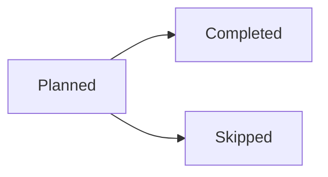
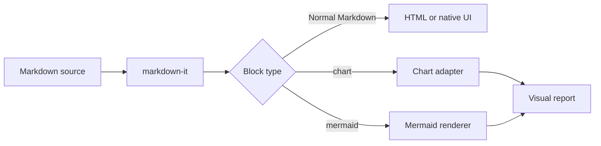

# Markdown-Native Visual Reports for Springroll

**Design exploration — August 2026**

## Summary

Springroll can support charts and richer visual output without replacing Markdown or inventing a completely new document language.

The basic idea is to keep a run result as ordinary Markdown, while recognizing a small number of specially labeled fenced blocks:

````markdown
# Weekly routine report

You completed **18 of 21** planned routines this week.

```chart
{
  "version": 1,
  "type": "line",
  "title": "Completed routines",
  "x": { "field": "day" },
  "series": [{ "field": "completed", "label": "Completed" }],
  "data": [
    { "day": "Mon", "completed": 2 },
    { "day": "Tue", "completed": 3 },
    { "day": "Wed", "completed": 2 },
    { "day": "Thu", "completed": 3 },
    { "day": "Fri", "completed": 3 }
  ]
}
```


````

A normal Markdown viewer sees two code blocks. Springroll recognizes `chart` and `mermaid` and upgrades them into visual components.

This creates a useful separation:

1. **Markdown remains the document format.**
2. **Springroll defines the meaning of a few semantic blocks.**
3. **A chart specification describes the visualization.**
4. **A replaceable rendering engine draws it.**

A reasonable direction is therefore to build a **Springroll Markdown renderer on top of markdown-it**, rather than fork markdown-it or replace Markdown itself.

---

## The core model

Today, the rendering path is probably close to this:

```text
LLM or task output
        ↓
Markdown string
        ↓
markdown-it
        ↓
HTML
        ↓
Springroll interface
```

Rich blocks add one dispatch step:

```text
LLM or task output
        ↓
Markdown string
        ↓
markdown-it parses the document
        ↓
Springroll renderer examines block types
        ├── normal Markdown → normal HTML/UI
        ├── chart           → chart component
        ├── mermaid         → Mermaid component
        └── unknown fence   → ordinary code block
```

The same flow can be shown as a Mermaid diagram:



The fenced block label is already part of normal Markdown syntax. In this example:

````markdown
```chart
{ "type": "bar", "data": [] }
```
````

markdown-it parses the block as a standard fence token whose language or `info` value is `chart`. Springroll does not need to modify the Markdown grammar merely to recognize it.

This is the same general extension pattern used by tools that render `mermaid`, `vega-lite`, `dot`, `plantuml`, and other special blocks inside Markdown documents.

---

## What Springroll would actually own

There are three different things that are easy to blur together.

### 1. Markdown syntax

This includes headings, paragraphs, links, lists, tables, blockquotes, code fences, and other familiar Markdown constructs.

Springroll does not gain much by owning this layer. markdown-it already handles parsing, compatibility, escaping, edge cases, and an existing plugin ecosystem.

### 2. Springroll document semantics

This is the potentially valuable layer.

Springroll can define that certain fenced blocks have special meaning:

```text
chart      quantitative visualization
mermaid   diagrams, relationships, schedules, and flows
metrics    compact KPI cards
status     service or task status display
timeline   chronological events
progress   completion or goal progress
```

Only `chart` and `mermaid` may be needed initially. The important point is that Springroll owns the **semantic contract**, not necessarily the parser or rendering library.

### 3. Rendering implementation

The implementation beneath `chart` can change over time:

```text
Springroll chart block
        ↓
Flint
        ↓
Vega-Lite
```

or:

```text
Springroll chart block
        ↓
Springroll's small schema adapter
        ↓
ECharts / Chart.js / Recharts
```

or even:

```text
Springroll chart block
        ↓
Direct Vega-Lite specification
        ↓
Vega renderer
```

The saved Markdown does not have to expose that choice.

---

## A useful naming distinction

It may be tempting to call this a new Markdown language. That is not necessarily wrong, but it can make the design sound more complicated than it is.

More precise descriptions would be:

- **Springroll Markdown extensions**
- **Springroll visual blocks**
- **Springroll documents**
- **Springroll's Markdown renderer**

The source remains valid Markdown. Springroll simply gives some otherwise ordinary code fences richer semantics.

This is useful because unsupported viewers degrade gracefully. GitHub, a text editor, or an unconfigured Obsidian vault can still display the document and its chart specification as text rather than failing to open it.

---

## How this can work with markdown-it

markdown-it already exposes parsed fence tokens and allows renderer rules to be replaced or extended. There are several viable integration levels.

## Option A: Intercept known fences during HTML rendering

This is the smallest change to an existing Markdown-to-HTML pipeline.

Conceptually:

```ts
const visualRenderers = new Set(["chart", "mermaid"])

md.renderer.rules.fence = (tokens, index, options, env, self) => {
  const token = tokens[index]
  const blockType = token.info.trim().split(/\s+/)[0]

  if (!visualRenderers.has(blockType)) {
    return renderNormalCodeFence(tokens, index, options, env, self)
  }

  const blockId = env.visualBlocks.register({
    type: blockType,
    source: token.content,
  })

  return `<div data-springroll-block="${blockType}" data-block-id="${blockId}"></div>`
}
```

After markdown-it produces HTML, the application mounts the corresponding chart or Mermaid component into each placeholder.

### Advantages

- Minimal disruption to the current renderer.
- Fast to prototype.
- Normal Markdown rendering remains unchanged.
- Unknown fenced languages continue to behave as code blocks.

### Limitations

- Mixing an HTML string with mounted React components can become awkward.
- Server rendering, cleanup, hydration, and resize behavior need care.
- The HTML output is no longer the complete representation of the page by itself.

This can still be entirely adequate for an initial implementation.

## Option B: Parse with markdown-it, then create a Springroll document model

Instead of immediately turning every token into HTML, Springroll can convert markdown-it tokens into a small internal document tree:

```ts
type SpringrollNode =
  | { type: "heading"; level: number; children: SpringrollNode[] }
  | { type: "paragraph"; children: SpringrollNode[] }
  | { type: "list"; items: SpringrollNode[][] }
  | { type: "table"; rows: unknown[] }
  | { type: "code"; language?: string; source: string }
  | { type: "chart"; spec: unknown }
  | { type: "mermaid"; source: string }
```

The pipeline becomes:

```text
Markdown source
      ↓
markdown-it tokens
      ↓
Springroll document tree
      ↓
React renderer
```

### Advantages

- React can render charts, Markdown elements, errors, loading states, and interactions in one component tree.
- The same semantic document can support desktop, web, mobile, export, and email renderers.
- Validation can happen before anything is displayed.
- Visual blocks become first-class nodes instead of HTML placeholders.

### Limitations

- More initial engineering than a fence override.
- Converting every Markdown token into an application node can recreate work that markdown-it's HTML renderer already performs.
- Inline Markdown, nested lists, tables, and plugins need deliberate handling.

A hybrid is possible: preserve markdown-it for ordinary Markdown sections while promoting only known visual fences into structured application nodes.

## Option C: Build a renderer registry

Whether Springroll starts with placeholders or a document tree, visual blocks can be routed through a registry:

```ts
registerVisualBlock({
  name: "chart",
  parse: parseChartSpec,
  validate: validateChartSpec,
  render: SpringrollChart,
  export: exportChart,
})

registerVisualBlock({
  name: "mermaid",
  parse: source => source,
  validate: validateMermaid,
  render: MermaidDiagram,
  export: exportMermaid,
})
```

This makes the architecture extensible without changing Markdown syntax or forking markdown-it. It also provides a natural boundary for an internal package such as:

```text
@springroll/markdown
@springroll/document-renderer
@springroll/visual-blocks
```

---

## Chart specification options

The fence mechanism is the easy part. The more important choice is what goes **inside** a `chart` block.

There is no single required answer. The following options can all work.

## Option 1: A small Springroll-owned chart schema

The model produces a deliberately constrained specification:

```json
{
  "version": 1,
  "type": "bar",
  "title": "Tasks completed by routine",
  "summary": "Reading led with 6 completions, followed by Planning (5) and Workout (4).",
  "x": { "field": "routine", "label": "Routine" },
  "series": [
    { "field": "completed", "label": "Completed" }
  ],
  "data": [
    { "routine": "Workout", "completed": 4 },
    { "routine": "Reading", "completed": 6 },
    { "routine": "Planning", "completed": 5 }
  ]
}
```

The `summary` field is a short natural-language description of what the chart shows. It solves three problems at once: it becomes the text fallback for email and plain-text export, it serves as the accessible description for screen readers, and it provides a graceful degradation path when the chart fails validation or rendering. It is also a subtle fidelity check — an evaluation suite can compare the summary's claims against the data.

Springroll maps that schema into a renderer such as ECharts, Chart.js, Recharts, Vega-Lite, or another library.

### Strengths

- Very predictable for models to generate.
- Springroll controls themes, axes, tooltips, spacing, accessibility, and responsiveness.
- The persisted format is independent of a rendering library.
- Validation and migration can be straightforward.

### Tradeoffs

- Springroll must design and maintain the schema.
- Every advanced chart capability has to be deliberately added.
- It can gradually turn into a visualization language of its own.

This works best when the product needs a relatively small, opinionated chart vocabulary.

## Option 2: A Springroll `chart` block backed by Flint

[Flint](https://github.com/microsoft/flint-chart) is an open-source intermediate visualization language aimed at AI-generated charts. Its goal is to let an agent produce a smaller semantic specification while deterministic code derives many lower-level layout and styling decisions.

At the time of writing, Flint describes support for compiling the same input into backends including Vega-Lite, ECharts, Chart.js, Plotly, and Excel-native output.

The architecture could be:

```text
Springroll chart block
        ↓
Springroll validates the semantic specification
        ↓
Flint compiles it
        ↓
The chosen rendering backend draws it
```

### Strengths

- Designed specifically around the reliability problems of agent-generated charts.
- Less custom chart-design logic has to live in Springroll prompts or code.
- A backend-independent intermediate representation can preserve flexibility.
- Semantic validation may produce more useful failures than raw renderer errors.

### Tradeoffs

- It is a newer dependency and may evolve quickly.
- Springroll would inherit some of its concepts and compatibility decisions.
- Its abstraction may be broader or more opinionated than Springroll needs.
- Persisting raw Flint specs would couple stored documents to an external format.

One way to reduce coupling is to retain the public fence name `chart` and treat Flint as an internal compiler. Springroll can later migrate the implementation without renaming every stored block.

Flint should probably not be in the v1 critical path at all. It is a new dependency, its abstraction belongs to Microsoft rather than Springroll, and a small v1 chart schema can be mapped to ECharts or Vega-Lite in a few hundred lines of adapter code. Evaluation results can determine whether Flint earns its way in later.

## Option 3: Put Vega-Lite directly inside the block

[Vega-Lite](https://vega.github.io/vega-lite/) provides a declarative JSON grammar for interactive graphics. It supports marks, field encodings, transformations, layering, faceting, and interaction.

Example:

````markdown
```chart
{
  "data": {
    "values": [
      { "day": "Mon", "completed": 2 },
      { "day": "Tue", "completed": 3 }
    ]
  },
  "mark": "line",
  "encoding": {
    "x": { "field": "day", "type": "ordinal" },
    "y": { "field": "completed", "type": "quantitative" }
  }
}
```
````

### Strengths

- Powerful, mature, declarative visualization grammar.
- Avoids designing a custom chart language.
- Supports far more than basic bar and line charts.
- Specifications are portable within the Vega ecosystem.

### Tradeoffs

- More verbose and easier for a model to get subtly wrong.
- Gives the model significant control over presentation details.
- Springroll may need a normalization layer to keep reports visually consistent.
- Exposes the rendering implementation in the stored document unless wrapped.

This can be useful as an advanced escape hatch even if most charts use a simpler schema.

## Option 4: Use a renderer-native configuration

The block can contain a native ECharts, Chart.js, or similar configuration.

### Strengths

- Direct access to the renderer's full feature set.
- Little or no translation layer.
- Easy to prototype against an existing library.

### Tradeoffs

- Strongest coupling to one renderer.
- Native configurations are often verbose and presentation-heavy.
- Models may generate options that are unsupported, inconsistent, or unsafe.
- Migrating rendering libraries means migrating stored documents.

This is generally more attractive as an internal compiled output than as Springroll's long-term document contract.

## Option 5: Start with Mermaid for both diagrams and simple charts

[Mermaid](https://mermaid.js.org/) already uses text definitions and fits naturally inside Markdown fences. Its chart-related formats include XY charts with bars and lines, pie charts, radar diagrams, Sankey diagrams, quadrant charts, and Gantt charts. It is especially strong for flowcharts, sequences, timelines, state diagrams, architecture diagrams, mind maps, and other relationship-oriented visuals.

### Strengths

- Very small conceptual and implementation footprint.
- Models already tend to understand Mermaid syntax.
- Broad diagram vocabulary in addition to basic charts.
- Excellent fit for schedules, workflows, dependencies, and task explanations.

### Tradeoffs

- It is primarily a diagramming system, not a full quantitative visualization grammar.
- XY charts remain more limited than Vega-Lite, ECharts, or a dedicated chart library.
- Fine-grained tooltips, transformations, multiple encodings, faceting, and rich interaction are not its main strength.
- Some Mermaid formats are marked beta or experimental and may change.

Mermaid can cover a surprising amount of a first release, but it does not eliminate the potential value of a dedicated `chart` block.

---

## Comparison of chart approaches

| Approach | Model reliability | Visualization power | Springroll control | Renderer portability | Initial effort |
|---|---:|---:|---:|---:|---:|
| Small Springroll schema | High | Medium | High | High | Medium |
| Springroll block backed by Flint | High to medium | High | Medium to high | High | Medium |
| Direct Vega-Lite | Medium | Very high | Medium | Medium | Low to medium |
| Native renderer config | Low to medium | High | Low | Low | Low |
| Mermaid only | High | Low to medium for charts; high for diagrams | Medium | Medium | Low |

These do not have to be mutually exclusive. A practical design can support:

- `mermaid` for diagrams and schedules,
- `chart` for normal quantitative reports,
- and perhaps `vega-lite` later as an advanced or developer-facing escape hatch.

---

## Where Mermaid fits particularly well

Mermaid and a chart engine solve overlapping but different problems.

### Mermaid is strongest for relationships

Examples include:

- Task workflows
- Dependencies
- Scheduled execution flows
- Sequence diagrams
- State transitions
- Architecture diagrams
- Gantt schedules
- Timelines
- Kanban-style process views
- Sankey flows
- Mind maps

A useful mental model is:

```text
Mermaid answers: “How are these things connected or ordered?”
Chart answers:   “How do these quantities compare or change?”
```

### Mermaid can still cover basic quantitative reporting

A simple line chart can be represented as:

````markdown
```mermaid
xychart-beta
    title "Completed routines"
    x-axis [Mon, Tue, Wed, Thu, Fri]
    y-axis "Completed" 0 --> 5
    line [2, 3, 2, 3, 3]
```
````

That may be entirely sufficient for many routine summaries. The boundary only becomes important when Springroll needs richer data semantics, transformations, multiple series, larger datasets, annotations, reusable tooltips, or more sophisticated interaction.

One caution: `xychart-beta` is explicitly beta syntax and has shifted before. That instability is an argument for including a dedicated `chart` block from day one — even if it initially supports only line and bar charts — rather than shipping a Mermaid-only first release for quantitative data.

---

## Should Springroll fork markdown-it?

A fork is possible, but charts alone do not create a strong reason to do it.

markdown-it is already designed to expose tokens, replace renderer rules, and accept plugins. A `chart` fence can be supported without changing its grammar.

## Possible benefits of a fork

- Complete control over parser behavior and release timing.
- Custom token types could be built directly into the parser.
- A single package could expose exactly the syntax and defaults Springroll wants.
- Deep syntax changes would not depend on upstream extension points.

## Costs of a fork

- Springroll becomes responsible for keeping up with parser fixes and security issues.
- CommonMark compatibility and Markdown edge cases become an ongoing concern.
- Upstream plugins may become harder to use.
- Divergence makes future upgrades more expensive.
- Engineering effort moves toward parsing details rather than the visual-report product.

## A lower-cost alternative

Springroll can wrap markdown-it behind its own interface:

```ts
import { renderSpringrollDocument } from "@springroll/markdown"

const document = renderSpringrollDocument(source, {
  blocks: [chartBlock, mermaidBlock],
  theme: "system",
})
```

Consumers use Springroll's API while markdown-it remains an internal dependency. This gives Springroll freedom to change parsers later without requiring callers or stored documents to know about it.

A fork becomes more defensible only if Springroll eventually needs grammar that cannot be expressed cleanly through fences, plugins, or token transformations. Examples might include a truly custom compact syntax, inline interactive components, or unusual nesting behavior. Even then, a markdown-it plugin would likely be worth attempting before a permanent fork.

---

## A possible Springroll document architecture

The following layers keep responsibilities separate without forcing a specific chart library:

```text
┌───────────────────────────────────────────────┐
│ Source document                               │
│ Standard Markdown + named fenced blocks       │
└───────────────────────┬───────────────────────┘
                        ↓
┌───────────────────────────────────────────────┐
│ Parser                                        │
│ markdown-it                                   │
└───────────────────────┬───────────────────────┘
                        ↓
┌───────────────────────────────────────────────┐
│ Springroll interpretation layer               │
│ Recognize, parse, validate, and version blocks│
└───────────────────────┬───────────────────────┘
                        ↓
┌───────────────────────────────────────────────┐
│ Visual block registry                         │
│ chart · mermaid · future semantic components  │
└───────────────────────┬───────────────────────┘
                        ↓
┌───────────────────────────────────────────────┐
│ Rendering adapters                            │
│ React · static HTML/SVG · image · email        │
└───────────────────────┬───────────────────────┘
                        ↓
┌───────────────────────────────────────────────┐
│ Engines                                       │
│ Flint · Vega-Lite · ECharts · Chart.js · etc. │
└───────────────────────────────────────────────┘
```

This architecture lets Springroll own the user-facing document contract while preserving implementation choices.

---

## Validation and safety

Because these documents may be generated by models or external data, visual blocks should be treated as untrusted declarative input.

Useful safeguards include:

- Validate every chart payload against a versioned schema.
- Reject executable JavaScript, callbacks, expressions, and arbitrary components.
- Limit the number of data rows, series, labels, and rendered pixels.
- Decide whether external data URLs are forbidden, allowlisted, or fetched through a controlled connector.
- Sanitize ordinary Markdown HTML according to Springroll's trust model.
- Use Mermaid's stricter or sandboxed security settings for untrusted content.
- Catch rendering errors and fall back to a readable code block plus an explanation.
- Preserve the original source for debugging and future migration.
- Avoid allowing a block to select arbitrary packages or renderer modules.

A failed chart should not make the whole report unreadable. A graceful fallback might show:

```text
Chart could not be rendered: field “completed” was not found.

[View chart specification]
```

---

## Streaming

Most AI output is streamed, which means a renderer for AI workflows will constantly see **incomplete** Markdown: an unterminated fence, or half a JSON object inside a `chart` block. This is the defining constraint that separates "a Markdown renderer for AI workflows" from an ordinary Markdown renderer, and it is harder here than for plain Markdown because visual blocks carry structured payloads that cannot be partially parsed.

There are two defensible positions, and the choice should be made explicitly and stated in the spec:

### Option A: v1 is non-streaming

Documents are rendered only once complete. This is defensible for Springroll, since scheduled-run reports arrive as finished documents rather than token streams. It keeps v1 small.

### Option B: streaming-aware rendering

While a fence is open and its payload is incomplete:

- Ordinary Markdown renders progressively as usual.
- A known visual fence renders a placeholder or skeleton component.
- When the fence closes, the payload is parsed, validated, and the placeholder is upgraded to the real component.
- A fence that never closes (truncated output) degrades to the error fallback.

Even if v1 chooses Option A, the decision belongs in SPEC.md, because anyone evaluating a "Markdown renderer for AI workflows" will ask about streaming first. The design should at least avoid choices that make Option B impossible later.

---

## The prompt kit is part of the spec

For a format designed to be *generated* by models, documentation for humans is only half the deliverable. The project should ship, as first-class artifacts:

- A system-prompt snippet describing the chart schema and when to use each block type.
- The chart schema published as **JSON Schema**, usable directly with structured-output and constrained-decoding APIs.
- Few-shot examples covering common report shapes.

Publishing the schema as JSON Schema also collapses the "direct generation vs. structured generation" comparison into a single artifact: the same schema powers both paths, and evaluations measure which path each model needs.

---

## Data placement choices

Small reports can safely keep chart data inline:

```json
{
  "type": "line",
  "data": [
    { "date": "2026-08-01", "value": 12 },
    { "date": "2026-08-02", "value": 15 }
  ]
}
```

For larger results, several alternatives are possible:

### Inline data

Best for portability, exports, and simple documents. It can make Markdown large when a run contains many points.

### Reference a run artifact

```json
{
  "type": "line",
  "dataRef": "artifact://runs/abc123/daily-metrics.json"
}
```

This keeps documents small but makes them dependent on Springroll's artifact system and permissions.

### Reference a named table within the same result

A report could contain one structured dataset and several charts that reference it. This reduces duplication but adds a more complex document model.

### Store source and resolved representation

Springroll can preserve the original Markdown while separately caching parsed chart specs or rendered SVG. This can improve loading and exporting without changing the canonical source.

No single approach is required for every case. Inline data is likely the simplest default, with artifact references available for larger or reusable datasets.

---

## Export and cross-platform behavior

A semantic block can render differently depending on the destination:

| Destination | Possible behavior |
|---|---|
| Desktop or web | Interactive chart with tooltip, resize, and theme support |
| Mobile | Simplified responsive chart |
| PDF | Static SVG or rasterized image |
| Email | Static image plus textual summary or table |
| Plain Markdown viewer | Original fenced specification shown as code |
| Copy/paste | Markdown source, image, or both |

This is one of the strongest reasons to own a Springroll interpretation layer. The same source document can have multiple renderers without requiring the model to produce different formats for every destination.

---

## Versioning the contract

Visual blocks should have an explicit or inferable version from the beginning.

Inside the payload:

```json
{
  "version": 1,
  "type": "bar"
}
```

Or in the fence metadata:

````markdown
```chart version=1
...
```
````

Keeping the version inside JSON is generally easier to validate and migrate. A future renderer can recognize version 1, normalize it into the latest internal representation, and preserve old documents.

Springroll should also keep the source contract intentionally small, and this deserves to be a stated **spec principle** rather than an implementation preference, because every user request will pull the schema toward becoming a worse Vega-Lite:

> **Models set data, chart type, labels, and intent. The renderer sets everything visual** — colors, typography, axes, spacing, animation, theme, and accessibility defaults. Unsupported properties are rejected or ignored predictably.

A `vega-lite` escape-hatch fence is the pressure-release valve that makes it possible to say no to schema additions: anyone who genuinely needs faceting or layered encodings can use the escape hatch instead of expanding the core schema.

This keeps generated documents stable even as the rendering implementation evolves.

---

## Three reasonable implementation paths

These paths are alternatives rather than mandatory phases.

## Path 1: Minimal visual Markdown

```text
markdown-it
+ Mermaid fences
+ one chart fence
+ one chart renderer
```

The chart block can initially use direct Vega-Lite, Flint, or a small Springroll schema. Known fences are intercepted during HTML rendering.

This path tests whether users and routines actually benefit from visual output before a larger document system is built.

## Path 2: Springroll document renderer

```text
markdown-it parser
+ Springroll document nodes
+ React component renderer
+ chart and Mermaid adapters
+ static export adapter
```

This is more appropriate if visual reports become a central product surface, need editing, or need consistent behavior across desktop and hosted viewers.

## Path 3: Extensible visual-document platform

```text
versioned document model
+ visual block registry
+ multiple render targets
+ artifact references
+ plugin or extension API
```

This turns the renderer into a reusable subsystem and potentially an open-source package. It offers the most flexibility but also creates the largest long-term API surface.

---

## Open-source implementations worth studying

These projects demonstrate parts of the design rather than providing a single drop-in solution for Springroll.

### markdown-it

- Repository: <https://github.com/markdown-it/markdown-it>
- API documentation: <https://markdown-it.github.io/markdown-it/>
- Renderer rule examples: <https://github.com/markdown-it/markdown-it/blob/master/docs/examples/renderer_rules.md>
- Custom containers: <https://github.com/markdown-it/markdown-it-container>

Useful for understanding token parsing, fence metadata, renderer overrides, and plugin boundaries.

### Markdown Preview Enhanced

- Diagram documentation: <https://github.com/shd101wyy/markdown-preview-enhanced/blob/master/docs/diagrams.md>

This is a strong reference for the “fenced language selects a renderer” pattern. It supports Mermaid, Vega/Vega-Lite, Graphviz, D2, PlantUML, and other visual formats inside Markdown.

### Obsidian Charts

- Repository: <https://github.com/phibr0/obsidian-charts>

This demonstrates interactive chart rendering inside an existing Markdown-oriented application through a plugin rather than a new Markdown parser.

### Mermaid

- Overview: <https://mermaid.js.org/intro/>
- Syntax reference: <https://mermaid.js.org/intro/syntax-reference.html>
- XY charts: <https://mermaid.js.org/syntax/xyChart.html>
- Pie charts: <https://mermaid.js.org/syntax/pie.html>
- Radar diagrams: <https://mermaid.js.org/syntax/radar.html>
- Sankey diagrams: <https://mermaid.js.org/syntax/sankey.html>
- Gantt diagrams: <https://mermaid.js.org/syntax/gantt.html>
- Timeline diagrams: <https://mermaid.js.org/syntax/timeline.html>
- Security configuration: <https://mermaid.js.org/config/usage.html>

Useful for diagrams, workflows, schedules, relationships, and a subset of charts.

### Flint

- Repository: <https://github.com/microsoft/flint-chart>

Useful as a possible semantic intermediate layer for agent-generated charts and as a reference for separating chart intent from backend-specific rendering details.

### Vega-Lite

- Documentation: <https://vega.github.io/vega-lite/>

Useful as a mature declarative visualization grammar, a direct chart specification, or a compiled rendering target.

---

## Questions to answer through a prototype

A small prototype can resolve several design questions more effectively than choosing the final architecture in advance:

1. Can the models used by Springroll reliably generate and repair the selected chart format?
2. How often do routines actually need charts rather than tables, metrics, or Mermaid diagrams?
3. Should users edit the raw specification, use a form-based editor, or only view generated output?
4. Do chart results need to remain usable outside Springroll?
5. How important are interactive tooltips and filtering compared with static export quality?
6. How much data should be allowed inline before it becomes an artifact reference?
7. Does Flint meaningfully improve chart quality and validation for Springroll's real examples?
8. Is Mermaid sufficient for many scheduling and routine use cases on its own?
9. Will desktop and hosted execution use the exact same renderer package?
10. Should a chart be regenerated by the model when data changes, or should the saved semantic spec remain bound to updated data?

---

## Likely design center

Without locking in a final backend, a balanced design would look like this:

```text
Canonical source
    Standard Markdown

Semantic extensions
    chart fences
    mermaid fences

Parsing
    markdown-it

Springroll-owned layer
    Detect blocks
    Validate payloads
    Apply versions
    Select renderers
    Control themes and fallbacks

Replaceable implementation options
    Flint
    Vega-Lite
    ECharts
    Chart.js
    another chart engine
```

This preserves the simplicity and shareability of Markdown while giving Springroll a controlled vocabulary for richer AI-generated reports. It avoids prematurely taking responsibility for a Markdown parser, but leaves room for the renderer to become a meaningful product subsystem if visual documents become central to Springroll.
