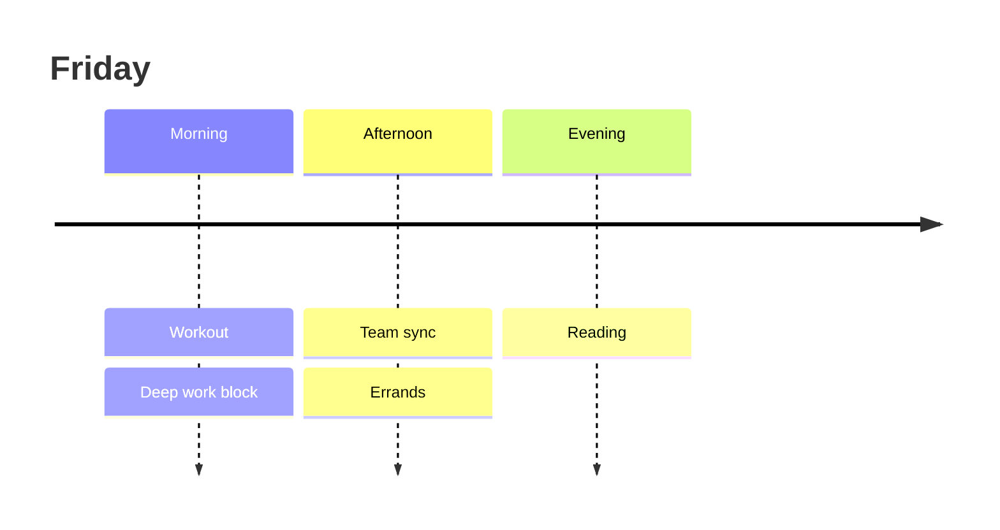

# Morning brief — Friday, August 8

Good morning. You completed **18 of 21** planned routines this week, your best week since June.

```chart
{
  "version": 1,
  "type": "bar",
  "title": "Routines completed by day",
  "summary": "Completions held steady at 2–3 per day, with all 3 planned routines finished on Thursday and Friday.",
  "x": { "field": "day", "label": "Day" },
  "series": [
    { "field": "completed", "label": "Completed" },
    { "field": "planned", "label": "Planned" }
  ],
  "data": [
    { "day": "Mon", "completed": 2, "planned": 3 },
    { "day": "Tue", "completed": 3, "planned": 3 },
    { "day": "Wed", "completed": 2, "planned": 3 },
    { "day": "Thu", "completed": 3, "planned": 3 },
    { "day": "Fri", "completed": 3, "planned": 3 },
    { "day": "Sat", "completed": 2, "planned": 3 },
    { "day": "Sun", "completed": 3, "planned": 3 }
  ]
}
```

## Today's schedule



One nudge: Wednesday has been your lightest day three weeks running — consider moving one routine to the morning.
