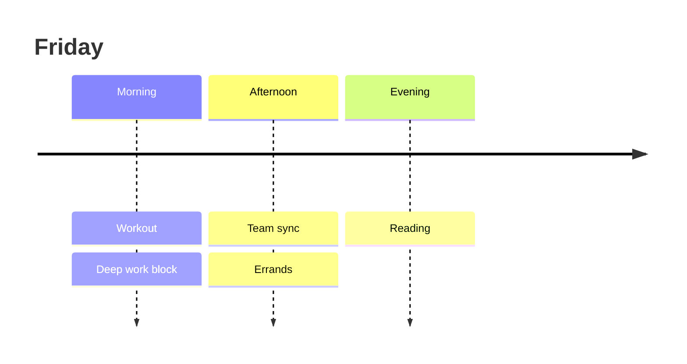

# Morning brief — Friday, August 8

Good morning. You completed **18 of 21** planned routines this week, your best week since June.

```chart
bar
title: Routines completed by day
summary: Completions held steady at 2–3 per day, with all 3 planned routines finished on Tuesday, Thursday, Friday, and Sunday.

day | Completed | Planned
Mon | 2 | 3
Tue | 3 | 3
Wed | 2 | 3
Thu | 3 | 3
Fri | 3 | 3
Sat | 2 | 3
Sun | 3 | 3
```

## Sleep vs. next-day energy

```chart
scatter
title: Sleep hours vs. energy score
summary: More sleep loosely tracks higher self-reported energy; nights under 6.5 hours cluster at the low end.

sleep hours | Energy score
6.1 | 4
6.4 | 5
6.8 | 6
7.2 | 7
7.5 | 7
7.9 | 9
8.2 | 8
```

## Today's schedule



One nudge: Wednesday has been your lightest day three weeks running — consider moving one routine to the morning.
