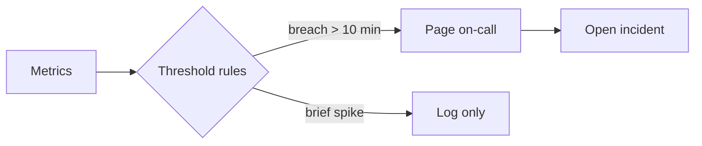

# Service health — overnight run

All services are healthy this morning. One latency spike on the API gateway at 02:00 resolved itself within ten minutes; no pages fired.

```chart
line
title: API gateway p95 latency (ms)
summary: p95 latency held near 180 ms overnight except for a spike to 640 ms at 02:00, which recovered by 03:00.

time | p95 (ms)
2026-08-08T00:00:00Z | 176
2026-08-08T01:00:00Z | 181
2026-08-08T02:00:00Z | 640
2026-08-08T03:00:00Z | 189
2026-08-08T04:00:00Z | 174
2026-08-08T05:00:00Z | 178
2026-08-08T06:00:00Z | 183
```

## Requests by service, stacked

```chart
bar
stack: true
title: Overnight requests by service (thousands)
summary: The API gateway carried most overnight traffic; jobs traffic doubled at 03:00 during the nightly batch window.

hour | API | Auth | Jobs
00:00 | 91 | 22 | 8
02:00 | 84 | 19 | 9
04:00 | 78 | 17 | 21
06:00 | 95 | 24 | 10
```

## Alert flow


