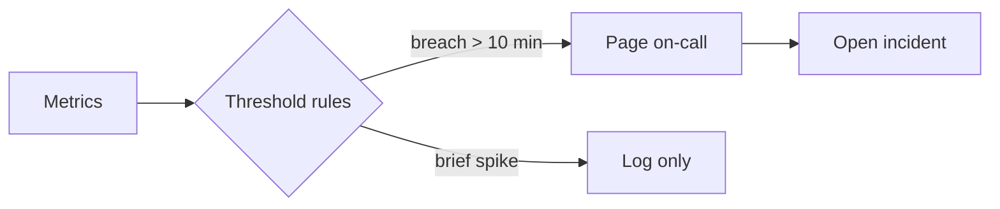

# Service health — overnight run

All services are healthy this morning. One latency spike on the API gateway at 02:00 resolved itself within ten minutes; no pages fired.

```chart
{
  "version": 1,
  "type": "line",
  "title": "API gateway p95 latency (ms)",
  "summary": "p95 latency held near 180 ms overnight except for a spike to 640 ms at 02:00, which recovered by 02:10.",
  "x": { "field": "time", "label": "Time", "type": "temporal" },
  "series": [{ "field": "p95", "label": "p95 latency (ms)" }],
  "data": [
    { "time": "2026-08-08T00:00:00Z", "p95": 176 },
    { "time": "2026-08-08T01:00:00Z", "p95": 181 },
    { "time": "2026-08-08T02:00:00Z", "p95": 640 },
    { "time": "2026-08-08T03:00:00Z", "p95": 189 },
    { "time": "2026-08-08T04:00:00Z", "p95": 174 },
    { "time": "2026-08-08T05:00:00Z", "p95": 178 },
    { "time": "2026-08-08T06:00:00Z", "p95": 183 }
  ]
}
```

## Error budget by service

```chart
{
  "version": 1,
  "type": "bar",
  "title": "Error budget consumed this month (%)",
  "summary": "The API gateway has consumed 42% of its monthly error budget; all other services remain under 20%.",
  "x": { "field": "service", "label": "Service" },
  "series": [{ "field": "consumed", "label": "Budget consumed (%)" }],
  "data": [
    { "service": "API gateway", "consumed": 42 },
    { "service": "Auth", "consumed": 11 },
    { "service": "Jobs", "consumed": 18 },
    { "service": "Storage", "consumed": 7 }
  ]
}
```

## Alert flow


