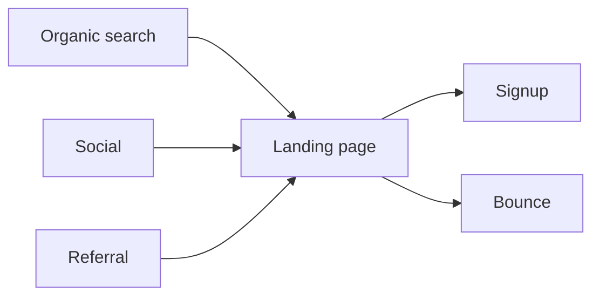

# Weekly acquisition report

Traffic increased **14%** this week, driven primarily by organic search. Signups kept pace, converting at 3.1% of visitors.

```chart
{
  "version": 1,
  "type": "line",
  "title": "Daily visitors",
  "summary": "Daily visitors grew from 1,240 on Monday to a peak of 1,610 on Saturday before easing to 1,540 on Sunday.",
  "x": { "field": "date", "label": "Date", "type": "temporal" },
  "series": [{ "field": "visitors", "label": "Visitors" }],
  "data": [
    { "date": "2026-08-03", "visitors": 1240 },
    { "date": "2026-08-04", "visitors": 1380 },
    { "date": "2026-08-05", "visitors": 1350 },
    { "date": "2026-08-06", "visitors": 1470 },
    { "date": "2026-08-07", "visitors": 1510 },
    { "date": "2026-08-08", "visitors": 1610 },
    { "date": "2026-08-09", "visitors": 1540 }
  ]
}
```

## Where visitors came from

```chart
{
  "version": 1,
  "type": "bar",
  "title": "Visitors by channel",
  "summary": "Organic search led with 4,890 visitors, ahead of social (2,310), direct (1,750), and referral (1,150).",
  "x": { "field": "channel", "label": "Channel" },
  "series": [{ "field": "visitors", "label": "Visitors" }],
  "data": [
    { "channel": "Organic search", "visitors": 4890 },
    { "channel": "Social", "visitors": 2310 },
    { "channel": "Direct", "visitors": 1750 },
    { "channel": "Referral", "visitors": 1150 }
  ]
}
```

## Acquisition flow



Next week we will watch whether the weekend lift in organic traffic holds.
