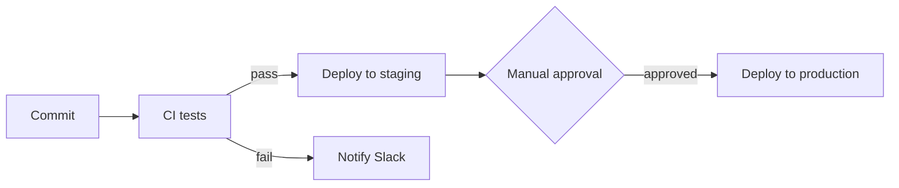

# Rollmark few-shot examples

Input/output pairs for prompting or eval baselines. Each shows source data and the expected Rollmark output. Note in every example: exact data preservation, a `summary` consistent with the data, and no styling properties.

## Example 1: Time series (temporal line chart)

**Input data:**

```text
Daily active users this week:
Mon 2026-08-03: 4,120
Tue 2026-08-04: 4,340
Wed 2026-08-05: 4,290
Thu 2026-08-06: 4,510
Fri 2026-08-07: 4,730
```

**Expected output:**

````markdown
# Daily active users

Active users grew **14.8%** across the week, ending at 4,730 on Friday.

```chart
{
  "version": 1,
  "type": "line",
  "title": "Daily active users",
  "summary": "Daily active users rose from 4,120 on Monday to 4,730 on Friday, with a small dip on Wednesday.",
  "x": { "field": "date", "label": "Date", "type": "temporal" },
  "series": [{ "field": "users", "label": "Active users" }],
  "data": [
    { "date": "2026-08-03", "users": 4120 },
    { "date": "2026-08-04", "users": 4340 },
    { "date": "2026-08-05", "users": 4290 },
    { "date": "2026-08-06", "users": 4510 },
    { "date": "2026-08-07", "users": 4730 }
  ]
}
```
````

## Example 2: Category comparison (bar chart, two series)

**Input data:**

```text
Support tickets by product area, opened vs resolved this week:
Billing: 34 opened, 29 resolved
Onboarding: 21 opened, 22 resolved
API: 45 opened, 31 resolved
```

**Expected output:**

````markdown
# Weekly support summary

The API area is falling behind: 45 tickets opened against 31 resolved.

```chart
{
  "version": 1,
  "type": "bar",
  "title": "Tickets opened vs. resolved by area",
  "summary": "API had the most activity with 45 opened and 31 resolved; Billing and Onboarding stayed roughly balanced.",
  "x": { "field": "area", "label": "Product area" },
  "series": [
    { "field": "opened", "label": "Opened" },
    { "field": "resolved", "label": "Resolved" }
  ],
  "data": [
    { "area": "Billing", "opened": 34, "resolved": 29 },
    { "area": "Onboarding", "opened": 21, "resolved": 22 },
    { "area": "API", "opened": 45, "resolved": 31 }
  ]
}
```
````

## Example 3: Workflow (Mermaid, not a chart)

**Input data:**

```text
Deploy pipeline: commits go to CI; CI runs tests; passing builds deploy to
staging; after manual approval they deploy to production; failures notify Slack.
```

**Expected output:**

````markdown
## Deploy pipeline


````

## Example 4: Small data — no visual block

**Input data:**

```text
Storage used: 412 GB of 500 GB (82%)
```

**Expected output:**

````markdown
Storage is at **412 GB of 500 GB (82%)**. At the current growth rate, consider expanding within the next quarter.
````

A single value does not need a chart.
