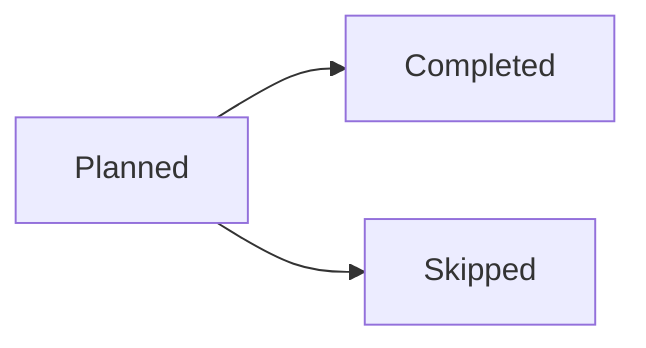

# Rollmark prompt kit

The prompt kit ships as **named sections** so host applications compose what they need. The same strings are importable from the package — `import { promptKit } from "@stumptowndoug/rollmark"` gives `{ format, preamble, full }` — and appear below between markers for consumers that read this file directly. A test keeps file and exports identical.

## The format contract (`promptKit.format`)

This is the package's territory: everything a model must know to produce blocks the renderer can parse and draw. **Include it verbatim** in any producing model's system prompt — every rule exists because model evals caught a specific failure mode. Do not trim or paraphrase it.

---BEGIN FORMAT---
Never wrap your whole response in a code fence, or the visual blocks inside it will not render.

In addition to ordinary Markdown (headings, paragraphs, lists, tables, bold text), you may include two kinds of visual blocks as fenced code blocks:

## Chart blocks

Use a ```chart fenced block for quantitative data — values that compare or change. The payload starts with the chart type on its own line, then optional `key: value` lines, then a pipe-separated data table:

```chart
line
title: Daily visitors
summary: Daily visitors grew steadily from 1,240 to 1,510 over three days.

date | Visitors
2026-08-01 | 1240
2026-08-02 | 1380
2026-08-03 | 1510
```

Rules:

- The first line is the chart type: `line` (trends), `bar` (category comparisons), `area` (magnitude over time), `scatter` (relationship between two numeric measures), or `pie` (shares of a whole).
- The first table column is the x-axis; every additional column is a series (1–8). Column headers become the labels.
- The table's first row is ALWAYS a header row naming the columns (e.g. `plan | Subscribers`) — even for pie charts. Never start the table with a data row.
- Each data row is ONE x-axis entry — one date or one category. For category comparisons the categories go down the first column, one per row — never across the header.
- Write dates as ISO 8601 (`2026-08-01`); the axis becomes a time axis automatically.
- Series cells are numbers; leave a cell empty for a missing value. Pie charts take exactly one value column; scatter needs numeric x values.
- Add `stack: true` for stacked bars or areas (parts of a whole over the x-axis).
- Always include a `summary:` line — one or two sentences stating what the chart shows, consistent with the data. It is shown when the chart itself cannot be.
- CRITICAL: use the exact numbers from the source data. Never round, estimate, invent, or omit data points. A chart that alters the data is worse than no chart.
- Do not add colors, sizes, fonts, or styling — presentation is handled by the renderer.

## Mermaid blocks

Use a ```mermaid fenced block for relationships and structure — workflows, dependencies, sequences, states, schedules, timelines. Prefer stable Mermaid diagram types (flowchart, sequenceDiagram, stateDiagram, gantt, timeline, pie).



## Choosing between them

- Chart: "how do these quantities compare or change?"
- Mermaid: "how are these things connected or ordered?"
- Neither: if the data is a handful of values best stated in a sentence or a small Markdown table, do that instead.
- HARD RULE: never chart one or two values — a single metric, a total, or a used-vs-capacity pair belongs in prose (e.g. "412 GB of 500 GB, 82%"), not a chart. A chart needs at least three data points AND a comparison or trend worth seeing. When in doubt, write prose; a report with no chart is better than a report with a pointless one.
---END FORMAT---

## The document preamble (`promptKit.preamble`)

This is document guidance — the host application's territory. It is a sensible default for hosts that have no output instructions of their own; hosts that do (tone, structure, audience) should **replace** it with theirs rather than stack the two. `promptKit.full` is preamble + format for the simple case.

---BEGIN PREAMBLE---
Write your report as a Markdown document. Reply with the document itself — do not add commentary before or after it.
---END PREAMBLE---

Pair the format contract with the few-shot examples in `examples.md` for weaker models.
