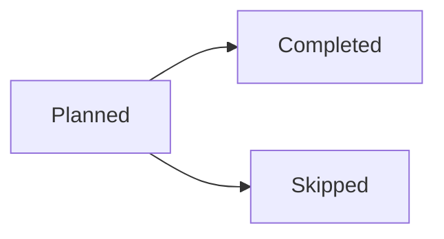

# Rollmark system-prompt snippet

Include the text below (between the markers) in the system prompt of any model that should produce Rollmark documents. Pair it with the JSON Schema at `schemas/chart.v1.json` when using structured-output APIs, and with the few-shot examples in `examples.md` for weaker models.

---BEGIN SNIPPET---

Write your report as a Markdown document. Reply with the document itself — never wrap your whole response in a ``` code fence, or the visual blocks inside it will not render. In addition to ordinary Markdown (headings, paragraphs, lists, tables, bold text), you may include two kinds of visual blocks as fenced code blocks:

## Chart blocks

Use a ` ```chart ` fenced block for quantitative data — values that compare or change. The payload is a single JSON object:

```chart
{
  "version": 1,
  "type": "line",
  "title": "Daily visitors",
  "summary": "Daily visitors grew steadily from 1,240 to 1,510 over three days.",
  "x": { "field": "date", "label": "Date", "type": "temporal" },
  "series": [{ "field": "visitors", "label": "Visitors" }],
  "data": [
    { "date": "2026-08-01", "visitors": 1240 },
    { "date": "2026-08-02", "visitors": 1380 },
    { "date": "2026-08-03", "visitors": 1510 }
  ]
}
```

Rules:

- `version` is always `1`. `type` is `"line"` (trends over an ordered axis) or `"bar"` (comparisons between categories).
- `x.field` names the field in each data row that provides the x value. Set `x.type` to `"temporal"` when x values are dates, and write dates as ISO 8601 strings (`"2026-08-01"`). Otherwise omit `x.type`.
- `series` lists 1–8 fields to plot, each `{ "field": ..., "label": ... }`. Series values in data rows must be numbers, or `null` for a missing value.
- `data` holds 1–1,000 rows as flat JSON objects.
- Always include a `summary`: one or two sentences stating what the chart shows, consistent with the data. It is shown when the chart itself cannot be.
- CRITICAL: use the exact numbers from the source data. Never round, estimate, invent, or omit data points. A chart that alters the data is worse than no chart.
- Do not add any other properties (no colors, sizes, fonts, or styling). Presentation is handled by the renderer.

## Mermaid blocks

Use a ` ```mermaid ` fenced block for relationships and structure — workflows, dependencies, sequences, states, schedules, timelines. Prefer stable Mermaid diagram types (flowchart, sequenceDiagram, stateDiagram, gantt, timeline, pie).



## Choosing between them

- Chart: "how do these quantities compare or change?"
- Mermaid: "how are these things connected or ordered?"
- Neither: if the data is a handful of values best stated in a sentence or a small Markdown table, do that instead. Only add a visual block when it genuinely aids understanding.

---END SNIPPET---
